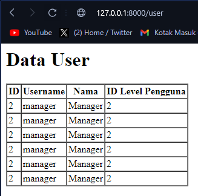

# Laporan Jobsheet 4

> Nama : Haidar Aly

> Kelas : TI-2F

> Absen : 14

## Praktikum 1

### Fillable Praktik
#### Dengan Password

#### Tanpa Password

## Praktikum 2

### 2.1 Praktik
#### Find & first where

#### Find Or

#### Find Or (20)

### 2.2 Praktek
#### Find Or Fail

#### Find Or Fail 2

### 2.3 Praktek
#### Count

#### Count View

### 2.4 Praktek
#### Create

#### First Create

#### First New

#### New

#### New Save

### 2.5 Praktek
#### Dirty Clean

#### Was Changed

### 2.6 Praktek
#### CRUD

#### Tambah

#### Tambah 2

#### Edit

#### Edit 2

#### Hapus

### 2.7 Praktek
#### Belongs

<!-- # Jawaban Pertanyaan Jobsheet 3

### 1. Pada Praktikum 1 - Tahap 5, apakah fungsi dari APP_KEY pada file setting .env Laravel?
> Fungsi dari APP_KEY adalah untuk mengenkripsi data yang akan disimpan di database.

### 2. Pada Praktikum 1, bagaimana kita men-generate nilai untuk APP_KEY?
> Ketikkan perintah di terminal : php artisan key:generate.

### 3. Pada Praktikum 2.1 - Tahap 1, secara default Laravel memiliki berapa file migrasi? dan untuk apa saja file migrasi tersebut?
> Terdapat 4 file migrasi, yaitu :
> 1. 2021_08_19_000000_create_password_resets_tokens_table
>> untuk membuat tabel password_resets_tokens yang digunakan untuk mengatur token reset password.
> 2. 2021_08_19_000001_create_users_table
>> untuk membuat tabel users yang digunakan untuk menyimpan data user.
> 3. 2021_08_19_000002_create_failed_jobs_table
>> untuk membuat tabel failed_jobs yang digunakan untuk menyimpan data failed job yang terjadi pada aplikasi.
> 4. 2021_08_19_000003_create_personal_access_tokens_table
>> untuk membuat tabel personal_access_tokens yang digunakan untuk menyimpan data token personal access yang digunakan untuk mengatur token reset password dan lain sebagainya.

### 4. Secara default, file migrasi terdapat kode $table->timestamps();, apa tujuan/output dari fungsi tersebut?
> Fungsi tersebut digunakan untuk membuat kolom created_at dan updated_at pada tabel yang dibuat.

### 5. Pada File Migrasi, terdapat fungsi $table->id(); Tipe data apa yang dihasilkan dari fungsi tersebut?
> Tipe data yang dihasilkan adalah integer.

### 6. Apa bedanya hasil migrasi pada table m_level, antara menggunakan $table->id(); dengan menggunakan $table->id('level_id'); ?
> $table->id('level_id'); digunakan untuk membuat kolom level_id pada tabel m_level dengan tipe data big integer.

### 7. Pada migration, Fungsi ->unique() digunakan untuk apa?
> Fungsi ->unique() digunakan untuk membuat kolom pada tabel yang dibuat tidak boleh ada yang sama.

### 8. Pada Praktikum 2.2 - Tahap 2, kenapa kolom level_id pada tabel m_user menggunakan $tabel->unsignedBigInteger('level_id'), sedangkan kolom level_id pada tabel m_level menggunakan $tabel->id('level_id') ?
> $tabel->unsignedBigInteger('level_id') digunakan untuk membuat kolom level_id pada tabel m_user dengan tipe data unsigned big integer. Sedangkan $tabel->id('level_id') digunakan untuk membuat kolom level_id pada tabel m_level dengan tipe data big integer.

### 9. Pada Praktikum 3 - Tahap 6, apa tujuan dari Class Hash? dan apa maksud dari kode program Hash::make('1234');?
> Class Hash digunakan untuk mengenkripsi data yang akan disimpan di database. Kode program Hash::make('1234'); 

### 10. Pada Praktikum 4 - Tahap 3/5/7, pada query builder terdapat tanda tanya (?), apa kegunaan dari tanda tanya (?) tersebut?
> Tanda tanya (?) digunakan untuk menandakan bahwa data yang akan diambil dari database akan diberikan secara opsional.

### 11. Pada Praktikum 6 - Tahap 3, apa tujuan penulisan kode protected $table = ‘m_user’; dan protected $primaryKey = ‘user_id’; ?
> Tujuan dari penulisan kode tersebut adalah untuk menentukan nama tabel dan kolom primary key dari tabel yang akan dibuat.

### 12. Menurut kalian, lebih mudah menggunakan mana dalam melakukan operasi CRUD ke database (DB Façade / Query Builder / Eloquent ORM) ? jelaskan
> Pada praktikum 6, lebih mudah menggunakan Query Builder dari Laravel karena lebih mudah dalam penulisan kode dan lebih mudah dalam menggunakan fungsi yang ada pada Query Builder dari Laravel. -->